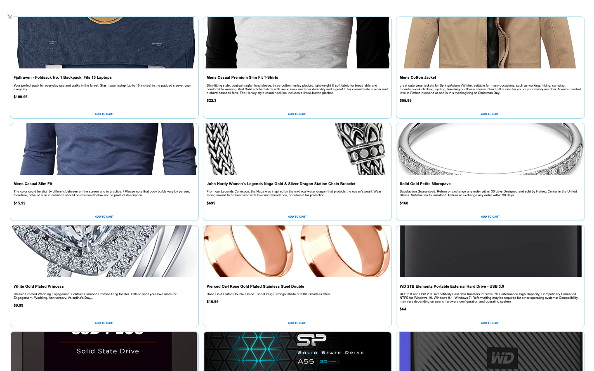
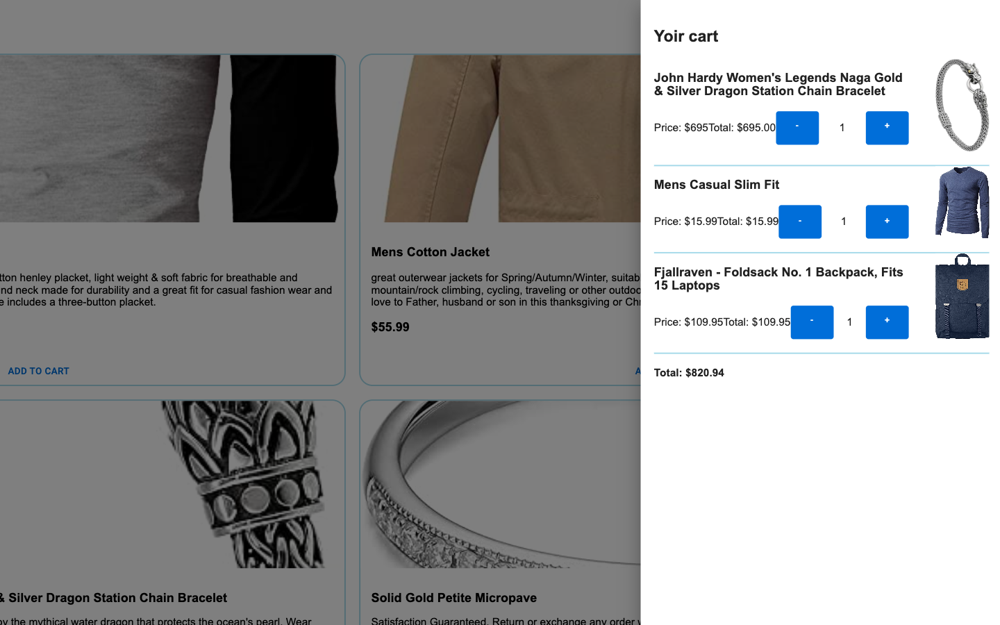

# Shopping Cart with React and TypeScript

Learn the fundamentals and how to build a ReactJS shopping cart with Typescript, Material UI, Styled Components and React-Query.

This project uses a free open API for dummy data to the items in the shop. React-Query hooks is used for fetching the data from the API.

Made by tutorial - [freeCodeCamp](https://youtu.be/sfmL6bGbiN8?si=6nN0xk5i7Tu2SrEm)

## Table of contents

- [Overview](#overview)
  - [Screenshot](#screenshot)
- [My process](#my-process)
  - [Built with](#built-with)
  - [What I learned](#what-i-learned)
  - [Useful resources](#useful-resources)

## Overview

### Screenshot

## My process

### Built with

- Semantic HTML5 markup
- CSS Grid
- [React](https://reactjs.org/) - JS library
- [Styled Components](https://styled-components.com/) - For styles
- TypeScript

### What I learned

How to use styled components, Material UI and the most important - TypeScript

### Useful resources

- [Material UI](https://mui.com/material-ui/getting-started/) (new version) component library that includes a comprehensive collection of prebuilt components that are ready for use in production .
- [Fake store API](https://fakestoreapi.com/products) - which provide all necessary data to imitate real store.
